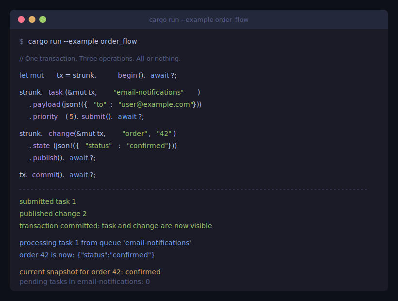

<p align="center">
  
</p>

<p align="center">
  Transactional task queues and change feeds backed by your database.
  <br/>
  No broker. No cluster. No new infrastructure.
</p>

---

<p align="center">
  
</p>

## What is this

Strunk is a Rust library that gives you durable task queues and entity change feeds using your existing PostgreSQL database. Everything runs inside your normal database transactions, so there is no dual-write problem, no separate broker to operate, and no new failure domain.

## The core idea

When your service wants to dispatch a task or publish a state change, it writes a row to an outbox table *in the same transaction* as its business data. A background relay delivers messages to consumers. If the transaction rolls back, the message never existed. If it commits, delivery is guaranteed.

```rust
let mut tx = strunk.begin().await?;

// Business logic
sqlx::query("UPDATE orders SET status = 'shipped' WHERE id = $1")
    .bind(order_id)
    .execute(&mut *tx)
    .await?;

// Queue a notification (same transaction)
strunk.task(&mut tx, "notifications")
    .payload(json!({"order_id": order_id, "type": "shipped"}))
    .submit()
    .await?;

// Publish state change (same transaction)
strunk.change(&mut tx, "order", &order_id.to_string())
    .state(json!({"id": order_id, "status": "shipped", "total": 59.99}))
    .publish()
    .await?;

tx.commit().await?;
// All three happen atomically. Or none of them do.
```

## Three primitives

**Task Queue** for work dispatch. Submit, claim, complete, fail. At-least-once delivery, priority ordering, visibility timeouts, exponential backoff, dead-letter inspection via SQL.

```rust
// Submit
strunk.task(&mut tx, "email-queue")
    .payload(json!({"to": "user@example.com"}))
    .priority(5)
    .max_retries(3)
    .submit()
    .await?;

// Process
strunk.worker("email-queue")
    .concurrency(4)
    .spawn(|task| async move {
        send_email(&task.payload).await?;
        Ok(()) // completes the task
        // Err(..) triggers retry with backoff
    });
```

**Change Feed** for state propagation. Publish the current state of an entity. Subscribers track their own cursor and resume from where they left off.

```rust
// Publish (with schema validation)
strunk.change(&mut tx, "order", "42")
    .state(json!({"id": 42, "status": "confirmed", "total": 59.99}))
    .schema_version("1.0")
    .publish()
    .await?;

// Subscribe
strunk.subscriber("search-indexer", "order")
    .spawn(|change| async move {
        update_index(change.entity_id, &change.state).await?;
        Ok(())
    });

// Snapshot (get current state without subscribing)
let state = strunk.snapshot("order", "42").await?;
```

**Schema Registry** for explicit coupling. Versioned contracts validated at publish time. Backward compatibility enforced automatically.

```rust
strunk.register_schema("order", "1.0", &json!({
    "properties": {
        "id": {"type": "integer"},
        "status": {"type": "string"},
        "total": {"type": "number"}
    },
    "required": ["id", "status", "total"]
}))?;

// Adding optional fields is fine
strunk.register_schema("order", "1.1", &json!({
    "properties": {
        "id": {"type": "integer"},
        "status": {"type": "string"},
        "total": {"type": "number"},
        "notes": {"type": "string"}
    },
    "required": ["id", "status", "total"]
}))?;

// Removing required fields or changing types fails at registration
```

## Observability

Everything is a SQL query.

```rust
let stats = strunk.queue_stats("email-queue").await?;
// stats.pending, stats.claimed, stats.dead, stats.delivered, stats.oldest_pending

let sub = strunk.subscriber_stats("search-indexer").await?;
// sub.lag, sub.last_seen_id, sub.latest_outbox_id

let overall = strunk.overall_stats().await?;
// overall.total_pending, overall.table_size
```

Dead letters are rows, not a separate topic:

```sql
SELECT * FROM strunk_outbox WHERE status = 'dead' AND key = 'email-queue';
-- Fix and retry:
UPDATE strunk_outbox SET status = 'pending', attempts = 0 WHERE id = 12345;
```

## Graceful shutdown

All background loops accept a cancellation token. Call `shutdown()` and workers drain cleanly.

```rust
// Shared token across all workers, subscribers, relay, reaper
let handles = strunk.worker("queue").spawn(handler);
let _sub = strunk.subscriber("indexer", "order").spawn(on_change);
let _reaper = strunk.reaper().spawn();

// On SIGTERM:
strunk.shutdown();
for h in handles { h.await.ok(); }
```

## What Strunk is not

- Not a stream processing engine. No windowed aggregations or stream joins.
- Not an event store. Publishes current state, not event history.
- Not a global ordering system. Per-entity ordering in the change feed, no ordering in the task queue (honestly).
- Not a broker replacement at scale. If you need 1M messages/second, use Kafka or Redpanda.

## Running the example

```bash
export DATABASE_URL="postgres://localhost/strunk_example"
createdb strunk_example
cargo run --example order_flow
```

## Running tests

```bash
export DATABASE_URL="postgres://localhost/strunk_test"
createdb strunk_test
cargo test
```

## Licence

MIT
